<div align="center">
<h1 style="color:#003A54; font-size: 40px; font-weight: bold">Análise de chamados por <em>status</em> (2022-2023)</h1>
</div>
<div align="right">
<small><i>Jéssica  Cardoso (Fevereiro 2024)</i></small>
</div>
<hr color="lightgray" align="left" size=1/>


<div align="center">

<h2 style="color:#003A54; font-size: 30px; font-weight: bold;">1. Introdução</h2>
</div>

<div style="max-width:1200px; width:80%; margin:0 auto;color:#003A54;text-align: justify;  font-size: 20px;">
<p>Inaugurado em 2018, <a href="http://www.1746.rio/" target="_blank">Central de Atendimento 1746</a> é o principal canal de comunicação entre o cidadão carioca e a Prefeitura do Rio <a href="http://www.rio.rj.gov.br/web/guest/exibeconteudo?id=8137995" target="_blank">[1]</a>. Nessa plataforma, é possível solicitar serviços, fazer reclamações, denúncias, sugestões, elogios e obter informações sobre a cidade. Os chamados são registrados e encaminhados para as unidades responsáveis pela resolução do problema, por exemplo, a Comlurb (Companhia Municipal de Limpeza Urbana) quando o chamado é sobre limpeza urbana, ou a CET-Rio (Companhia de Engenharia de Tráfego do Rio de Janeiro) quando o chamado é sobre trânsito. </p>
</p>
<!-- Data Rio -->
<p>Com o objetivo de promover uma disseminação mais eficaz da informação e aumentar a transparência dos dados públicos, foi desenvolvido o <a href="http://www.data.rio/" target="_blank">Data Rio</a>, um portal que reúne informações sobre a cidade do Rio de Janeiro <a href="https://www.data.rio/pages/histria" target="_blank">[2]</a>. Neste portal, é possível encontrar dados sobre diversos temas, como educação, saúde, segurança, transporte, entre outros.
</p>
<p>Um dos conjuntos de dados disponibilizados pelo Data Rio é o <a href="https://www.data.rio/documents/PCRJ::administra%C3%A7%C3%A3o-de-servi%C3%A7os-p%C3%BAblicos-chamados-feitos-ao-1746/about" target="_blank">Chamados 1746</a>, que contém informações sobre os chamados registrados na Central 1746. Este conjunto de dados é atualizado diariamente e contém informações sobre os chamados registrados desde março de 2011. Esses dados são disponibilizados no <a href="https://console.cloud.google.com/bigquery?p=datario&d=administracao_servicos_publicos&t=chamado_1746&page=table">Google BigQuery</a> e podem ser acessados por meio de consultas SQL. </p>
</p>
<p>O objetivo deste notebook é realizar uma análise exploratória dos chamados registrados na Central 1746 durante os anos de 2022 e 2023. Também será criado um modelo de aprendizado de máquina para prever o <em>status</em> de um chamado com base em suas características. </p>
<hr color="white" size=1 width=100% align="left"/>
</div>


```python
import pandas as pd
import pandas_gbq
import matplotlib.pyplot as plt
import numpy as np
from textwrap import wrap
from IPython.display import display, HTML
from sentence_transformers import SentenceTransformer
from sklearn.preprocessing import StandardScaler
from sklearn.decomposition import PCA
from sklearn.preprocessing import OneHotEncoder
from sklearn.pipeline import Pipeline
from sklearn.impute import SimpleImputer
from sklearn.ensemble import RandomForestClassifier
from sklearn.metrics import (
    classification_report,
    confusion_matrix,
    ConfusionMatrixDisplay,
)
from sklearn.model_selection import train_test_split

df = pd.read_parquet(
    "../data/chamado_1746.parquet",
    columns=[
        "id_chamado",
        "id_bairro",
        "data_inicio",
        "data_fim",
        "tipo",
        "subtipo",
        "status",
        "justificativa_status",
        "nome_unidade_organizacional",
        "unidade_organizacional_ouvidoria",
        "data_alvo_finalizacao",
        "data_alvo_diagnostico",
        "tempo_prazo",
        "prazo_unidade",
        "prazo_tipo",
        "dentro_prazo",
        "situacao",
        "reclamacoes",
        "latitude",
        "longitude",
    ],
)

df = df.set_index("id_chamado")
```

##
<div align="center">
<h2 style="color:#003A54; font-size: 30px; font-weight: bold;">2. Descrição dos Dados</h2>
</div>

<div style="max-width:1200px; width:80%; margin:0 auto;color:#003A54;text-align: justify;  font-size: 20px;">
<p>Os dados sobre os chamados registrados na Central 1746 estão disponíveis no Google BigQuery e podem ser acessados por meio de consultas SQL. O conjunto de dados <code>datario.administracao_servicos_publicos.chamado_1746</code> contém as seguintes colunas:</p>
<table style="border:1px solid #C0C0C0; border-collapse:collapse; padding:5px;">
        <tbody><tr>
            <th style="border:1px solid #C0C0C0; text-align:center; padding:5px; background:#F0F0F0;">Nome</th>
            <th style="border:1px solid #C0C0C0; text-align:center; padding:5px; background:#F0F0F0;">Descrição</th>
        </tr>
        </tbody><tbody>
                <tr>
                    <td style="border:1px solid #C0C0C0; text-align:center; padding:5px;">id_chamado</td>
                    <td style="border:1px solid #C0C0C0; text-align:center; padding:5px;">Identificador único do chamado no banco de dados.</td>
                </tr>
                <tr>
                    <td style="border:1px solid #C0C0C0; text-align:center; padding:5px;">data_inicio</td>
                    <td style="border:1px solid #C0C0C0; text-align:center; padding:5px;">Data de abertura do chamado. Ocorre quando o operador registra o chamado.</td>
                </tr>
                <tr>
                    <td style="border:1px solid #C0C0C0; text-align:center; padding:5px;">data_fim</td>
                    <td style="border:1px solid #C0C0C0; text-align:center; padding:5px;">Data de fechamento do chamado. O chamado é fechado quando o pedido é atendido ou quando se percebe que o pedido não pode ser atendido.</td>
                </tr>
                <tr>
                    <td style="border:1px solid #C0C0C0; text-align:center; padding:5px;">id_bairro</td>
                    <td style="border:1px solid #C0C0C0; text-align:center; padding:5px;">Identificador único, no banco de dados, do bairro onde ocorreu o fato que gerou o chamado.</td>
                </tr>
                <tr>
                    <td style="border:1px solid #C0C0C0; text-align:center; padding:5px;">id_territorialidade</td>
                    <td style="border:1px solid #C0C0C0; text-align:center; padding:5px;">Identificador único, no banco de dados, da territorialidade onde ocorreu o fato que gerou o chamado. Territorialidade é uma região da cidade do Rio de Janeiro que tem com responsável um órgão especifico. Exemplo: CDURP, que é responsável pela região do porto do Rio de Janeiro.</td>
                </tr>
                <tr>
                    <td style="border:1px solid #C0C0C0; text-align:center; padding:5px;">id_logradouro</td>
                    <td style="border:1px solid #C0C0C0; text-align:center; padding:5px;">Identificador único, no banco de dados, do logradouro onde ocorreu o fato que gerou o chamado.</td>
                </tr>
                <tr>
                    <td style="border:1px solid #C0C0C0; text-align:center; padding:5px;">numero_logradouro</td>
                    <td style="border:1px solid #C0C0C0; text-align:center; padding:5px;">Número da porta onde ocorreu o fato que gerou o chamado.</td>
                </tr>
                <tr>
                    <td style="border:1px solid #C0C0C0; text-align:center; padding:5px;">id_unidade_organizacional</td>
                    <td style="border:1px solid #C0C0C0; text-align:center; padding:5px;">Identificador único, no banco de dados, do órgão que executa o chamado. Por exemplo: identificador da COMLURB quando o chamado é relativo a limpeza urbana.</td>
                </tr>
                <tr>
                    <td style="border:1px solid #C0C0C0; text-align:center; padding:5px;">nome_unidade_organizacional</td>
                    <td style="border:1px solid #C0C0C0; text-align:center; padding:5px;">Nome do órgão que executa a demanda. Por exemplo: COMLURB quando a demanda é relativa a limpeza urbana.</td>
                </tr>
                <tr>
                    <td style="border:1px solid #C0C0C0; text-align:center; padding:5px;">unidade_organizadional_ouvidoria</td>
                    <td style="border:1px solid #C0C0C0; text-align:center; padding:5px;">Booleano indicando se o chamado do cidadão foi feita Ouvidoria ou não. 1 caso sim, 0 caso não,</td>
                </tr>
                <tr>
                    <td style="border:1px solid #C0C0C0; text-align:center; padding:5px;">categoria</td>
                    <td style="border:1px solid #C0C0C0; text-align:center; padding:5px;">Categoria do chamado. Exemplo: Serviço, informação, sugestão, elogio, reclamação, crítica.</td>
                </tr>
                <tr>
                    <td style="border:1px solid #C0C0C0; text-align:center; padding:5px;">id_tipo</td>
                    <td style="border:1px solid #C0C0C0; text-align:center; padding:5px;">Identificador único, no banco de dados, do tipo do chamado. Ex: Iluminação pública.</td>
                </tr>
                <tr>
                    <td style="border:1px solid #C0C0C0; text-align:center; padding:5px;">tipo</td>
                    <td style="border:1px solid #C0C0C0; text-align:center; padding:5px;">Nome do tipo do chamado. Ex: Iluminação pública.</td>
                </tr>
                <tr>
                    <td style="border:1px solid #C0C0C0; text-align:center; padding:5px;">id_subtipo</td>
                    <td style="border:1px solid #C0C0C0; text-align:center; padding:5px;">Identificador único, no banco de dados, do subtipo do chamado. Ex: Reparo de lâmpada apagada.</td>
                </tr>
                <tr>
                    <td style="border:1px solid #C0C0C0; text-align:center; padding:5px;">subtipo</td>
                    <td style="border:1px solid #C0C0C0; text-align:center; padding:5px;">Nome do subtipo do chamado.  Ex: Reparo de lâmpada apagada.</td>
                </tr>
                <tr>
                    <td style="border:1px solid #C0C0C0; text-align:center; padding:5px;">status</td>
                    <td style="border:1px solid #C0C0C0; text-align:center; padding:5px;">Status do chamado. Ex. Fechado com solução, aberto em andamento, pendente etc.</td>
                </tr>
                <tr>
                    <td style="border:1px solid #C0C0C0; text-align:center; padding:5px;">longitude</td>
                    <td style="border:1px solid #C0C0C0; text-align:center; padding:5px;">Longitude do lugar do evento que motivou o chamado.</td>
                </tr>
                <tr>
                    <td style="border:1px solid #C0C0C0; text-align:center; padding:5px;">latitude</td>
                    <td style="border:1px solid #C0C0C0; text-align:center; padding:5px;">Latitude do lugar do evento que motivou o chamado.</td>
                </tr>
                <tr>
                    <td style="border:1px solid #C0C0C0; text-align:center; padding:5px;">data_alvo_finalizacao</td>
                    <td style="border:1px solid #C0C0C0; text-align:center; padding:5px;">Data prevista para o atendimento do chamado. Caso prazo_tipo seja D fica em branco até o diagnóstico ser feito.</td>
                </tr>
                <tr>
                    <td style="border:1px solid #C0C0C0; text-align:center; padding:5px;">data_alvo_diagnostico</td>
                    <td style="border:1px solid #C0C0C0; text-align:center; padding:5px;">Data prevista para fazer o diagnóstico do serviço.  Caso prazo_tipo seja F esta data fica em branco.</td>
                </tr>
                <tr>
                    <td style="border:1px solid #C0C0C0; text-align:center; padding:5px;">data_real_diagnostico</td>
                    <td style="border:1px solid #C0C0C0; text-align:center; padding:5px;">Data em que foi feito o diagnóstico do serviço.  Caso prazo_tipo seja F esta data fica em branco.</td>
                </tr>
                <tr>
                    <td style="border:1px solid #C0C0C0; text-align:center; padding:5px;">tempo_prazo</td>
                    <td style="border:1px solid #C0C0C0; text-align:center; padding:5px;">Prazo para o serviço ser feito. Em dias ou horas após a abertura do chamado. Caso haja diagnóstico o prazo conta após se fazer o diagnóstico.</td>
                </tr>
                <tr>
                    <td style="border:1px solid #C0C0C0; text-align:center; padding:5px;">prazo_unidade</td>
                    <td style="border:1px solid #C0C0C0; text-align:center; padding:5px;">Unidade de tempo utilizada no prazo. Dias ou horas. D ou H.</td>
                </tr>
                <tr>
                    <td style="border:1px solid #C0C0C0; text-align:center; padding:5px;">prazo_tipo</td>
                    <td style="border:1px solid #C0C0C0; text-align:center; padding:5px;">Diagnóstico ou finalização. D ou F. Indica se a chamada precisa de diagnóstico ou não. Alguns serviços precisam de avaliação para serem feitos, neste caso é feito o diagnóstico. Por exemplo, pode de árvore. Há a necessidade de um engenheiro ambiental verificar a necessidade da poda ou não.</td>
                </tr>
                <tr>
                    <td style="border:1px solid #C0C0C0; text-align:center; padding:5px;">id_unidade_organizacional_mae</td>
                    <td style="border:1px solid #C0C0C0; text-align:center; padding:5px;">ID da unidade organizacional mãe do orgão que executa a demanda. Por exemplo: "CVA - Coordenação de Vigilância de Alimentos" é quem executa a demanda e obede a unidade organizacional mãe "IVISA-RIO - Instituto Municipal de Vigilância Sanitária, de Zoonoses e de Inspeção Agropecuária". A coluna se refere ao ID  deste último.</td>
                </tr>
                <tr>
                    <td style="border:1px solid #C0C0C0; text-align:center; padding:5px;">situacao</td>
                    <td style="border:1px solid #C0C0C0; text-align:center; padding:5px;">Identifica se o chamado foi encerrado</td>
                </tr>
                <tr>
                    <td style="border:1px solid #C0C0C0; text-align:center; padding:5px;">tipo_situacao</td>
                    <td style="border:1px solid #C0C0C0; text-align:center; padding:5px;">Indica o status atual do chamado entre as categorias Atendido, Atendido parcialmente, Não atendido, Não constatado e Andamento</td>
                </tr>
                <tr>
                    <td style="border:1px solid #C0C0C0; text-align:center; padding:5px;">dentro_prazo</td>
                    <td style="border:1px solid #C0C0C0; text-align:center; padding:5px;">Indica se a data alvo de finalização do chamado ainda está dentro do prazo estipulado.</td>
                </tr>
                <tr>
                    <td style="border:1px solid #C0C0C0; text-align:center; padding:5px;">justificativa_status</td>
                    <td style="border:1px solid #C0C0C0; text-align:center; padding:5px;">Justificativa que os órgãos usam ao definir o status. Exemplo: SEM POSSIBILIDADE DE ATENDIMENTO - justificativa: Fora de área de atuação do municipio</td>
                </tr>
                <tr>
                    <td style="border:1px solid #C0C0C0; text-align:center; padding:5px;">reclamacoes</td>
                    <td style="border:1px solid #C0C0C0; text-align:center; padding:5px;">Quantidade de reclamações.</td>
                </tr>
        </tbody>
    </table>
    <p>Para a nossa análise, selecionamos algumas colunas que estavam mais relacionadas a situação do chamado, como a data de início e fim, o prazo para finalização, etc. </p>
</div>


```python
display(
    HTML(
        f"""
        <h3 style='color:#003A54; font-size: 25px; font-weight: bold;'>Primeiras linhas e últimas linhas do dataframe</h3>
        <div style="max-width:1200px; color:#003A54;text-align: justify;  font-size: 20px;">
        <ul>
            <li><b>Quantidade de linhas:</b> {df.shape[0]:,}</li>
            <li><b>Quantidade de colunas:</b> {df.shape[1]}</li>
            <li><b>Quantidade de valores únicos:</b> {df.nunique().sum():,}</li>
        </ul>
        </div
        """
    )
)
display(df.head())
display(HTML("<hr/>"))
display(df.tail())
```


<h3 style='color:#003A54; font-size: 25px; font-weight: bold;'>Primeiras linhas e últimas linhas do dataframe</h3>
<div style="max-width:1200px; color:#003A54;text-align: justify;  font-size: 20px;">
<ul>
    <li><b>Quantidade de linhas:</b> 1,617,598</li>
    <li><b>Quantidade de colunas:</b> 19</li>
    <li><b>Quantidade de valores únicos:</b> 3,947,157</li>
</ul>
</div


<div>
<table border="1" class="dataframe">
  <thead>
    <tr style="text-align: right;">
      <th></th>
      <th>id_bairro</th>
      <th>data_inicio</th>
      <th>data_fim</th>
      <th>tipo</th>
      <th>subtipo</th>
      <th>status</th>
      <th>justificativa_status</th>
      <th>nome_unidade_organizacional</th>
      <th>unidade_organizacional_ouvidoria</th>
      <th>data_alvo_finalizacao</th>
      <th>data_alvo_diagnostico</th>
      <th>tempo_prazo</th>
      <th>prazo_unidade</th>
      <th>prazo_tipo</th>
      <th>dentro_prazo</th>
      <th>situacao</th>
      <th>reclamacoes</th>
      <th>latitude</th>
      <th>longitude</th>
    </tr>
    <tr>
      <th>id_chamado</th>
      <th></th>
      <th></th>
      <th></th>
      <th></th>
      <th></th>
      <th></th>
      <th></th>
      <th></th>
      <th></th>
      <th></th>
      <th></th>
      <th></th>
      <th></th>
      <th></th>
      <th></th>
      <th></th>
      <th></th>
      <th></th>
      <th></th>
    </tr>
  </thead>
  <tbody>
    <tr>
      <th>17467358</th>
      <td>1</td>
      <td>2022-07-11 18:38:22</td>
      <td>2022-07-13 10:53:00</td>
      <td>Iluminação Pública</td>
      <td>Reparo de lâmpada apagada</td>
      <td>Fechado com solução</td>
      <td>None</td>
      <td>RIOLUZ - Companhia Municipal de Energia e Ilum...</td>
      <td>False</td>
      <td>2022-07-15 18:38:00</td>
      <td>NaT</td>
      <td>&lt;NA&gt;</td>
      <td>D</td>
      <td>F</td>
      <td>No prazo</td>
      <td>Encerrado</td>
      <td>0</td>
      <td>-22.897333</td>
      <td>-43.185928</td>
    </tr>
    <tr>
      <th>17540522</th>
      <td>4</td>
      <td>2022-07-30 20:30:28</td>
      <td>2022-07-31 10:42:00</td>
      <td>Iluminação Pública</td>
      <td>Reparo de lâmpada apagada</td>
      <td>Fechado com solução</td>
      <td>None</td>
      <td>RIOLUZ - Companhia Municipal de Energia e Ilum...</td>
      <td>False</td>
      <td>2022-08-03 20:30:00</td>
      <td>NaT</td>
      <td>&lt;NA&gt;</td>
      <td>D</td>
      <td>F</td>
      <td>No prazo</td>
      <td>Encerrado</td>
      <td>0</td>
      <td>-22.879455</td>
      <td>-43.216491</td>
    </tr>
    <tr>
      <th>17458811</th>
      <td>5</td>
      <td>2022-07-08 17:32:35</td>
      <td>2022-07-11 22:56:00</td>
      <td>Iluminação Pública</td>
      <td>Reparo de lâmpada apagada</td>
      <td>Fechado com solução</td>
      <td>None</td>
      <td>RIOLUZ - Companhia Municipal de Energia e Ilum...</td>
      <td>False</td>
      <td>2022-07-12 17:32:00</td>
      <td>NaT</td>
      <td>&lt;NA&gt;</td>
      <td>D</td>
      <td>F</td>
      <td>No prazo</td>
      <td>Encerrado</td>
      <td>0</td>
      <td>-22.905414</td>
      <td>-43.180249</td>
    </tr>
    <tr>
      <th>17511489</th>
      <td>5</td>
      <td>2022-07-22 20:50:55</td>
      <td>2022-07-24 11:19:00</td>
      <td>Iluminação Pública</td>
      <td>Reparo de lâmpada apagada</td>
      <td>Fechado com solução</td>
      <td>None</td>
      <td>RIOLUZ - Companhia Municipal de Energia e Ilum...</td>
      <td>False</td>
      <td>2022-07-26 20:50:00</td>
      <td>NaT</td>
      <td>&lt;NA&gt;</td>
      <td>D</td>
      <td>F</td>
      <td>No prazo</td>
      <td>Encerrado</td>
      <td>0</td>
      <td>-22.901556</td>
      <td>-43.189442</td>
    </tr>
    <tr>
      <th>17445606</th>
      <td>5</td>
      <td>2022-07-05 18:58:09</td>
      <td>2022-07-05 23:07:00</td>
      <td>Iluminação Pública</td>
      <td>Reparo de lâmpada apagada</td>
      <td>Fechado com solução</td>
      <td>None</td>
      <td>RIOLUZ - Companhia Municipal de Energia e Ilum...</td>
      <td>False</td>
      <td>2022-07-09 18:58:00</td>
      <td>NaT</td>
      <td>&lt;NA&gt;</td>
      <td>D</td>
      <td>F</td>
      <td>No prazo</td>
      <td>Encerrado</td>
      <td>0</td>
      <td>-22.906541</td>
      <td>-43.175415</td>
    </tr>
  </tbody>
</table>
</div>


<hr/>


<div>
<table border="1" class="dataframe">
  <thead>
    <tr style="text-align: right;">
      <th></th>
      <th>id_bairro</th>
      <th>data_inicio</th>
      <th>data_fim</th>
      <th>tipo</th>
      <th>subtipo</th>
      <th>status</th>
      <th>justificativa_status</th>
      <th>nome_unidade_organizacional</th>
      <th>unidade_organizacional_ouvidoria</th>
      <th>data_alvo_finalizacao</th>
      <th>data_alvo_diagnostico</th>
      <th>tempo_prazo</th>
      <th>prazo_unidade</th>
      <th>prazo_tipo</th>
      <th>dentro_prazo</th>
      <th>situacao</th>
      <th>reclamacoes</th>
      <th>latitude</th>
      <th>longitude</th>
    </tr>
    <tr>
      <th>id_chamado</th>
      <th></th>
      <th></th>
      <th></th>
      <th></th>
      <th></th>
      <th></th>
      <th></th>
      <th></th>
      <th></th>
      <th></th>
      <th></th>
      <th></th>
      <th></th>
      <th></th>
      <th></th>
      <th></th>
      <th></th>
      <th></th>
      <th></th>
    </tr>
  </thead>
  <tbody>
    <tr>
      <th>18171630</th>
      <td>31</td>
      <td>2023-01-20 14:59:50</td>
      <td>2023-01-25 14:28:07</td>
      <td>Regulamentações Viárias</td>
      <td>Solicitação de implantação de estacionamento p...</td>
      <td>Sem possibilidade de atendimento</td>
      <td>None</td>
      <td>CTRT/AP 2.1 - Coordenadoria Técnica Regional d...</td>
      <td>False</td>
      <td>2023-02-06 00:00:00</td>
      <td>NaT</td>
      <td>&lt;NA&gt;</td>
      <td>D</td>
      <td>F</td>
      <td>No prazo</td>
      <td>Encerrado</td>
      <td>0</td>
      <td>-23.005568</td>
      <td>-43.282757</td>
    </tr>
    <tr>
      <th>18194312</th>
      <td>55</td>
      <td>2023-01-25 04:11:58</td>
      <td>2023-02-01 11:36:11</td>
      <td>Regulamentações Viárias</td>
      <td>Solicitação de implantação de estacionamento p...</td>
      <td>Sem possibilidade de atendimento</td>
      <td>None</td>
      <td>CTRT/AP 2.2 - Coordenadoria Técnica Regional d...</td>
      <td>False</td>
      <td>2023-02-08 04:11:00</td>
      <td>NaT</td>
      <td>&lt;NA&gt;</td>
      <td>D</td>
      <td>F</td>
      <td>No prazo</td>
      <td>Encerrado</td>
      <td>0</td>
      <td>-22.871808</td>
      <td>-43.298710</td>
    </tr>
    <tr>
      <th>18201272</th>
      <td>147</td>
      <td>2023-01-25 21:17:52</td>
      <td>2023-01-27 11:10:55</td>
      <td>Regulamentações Viárias</td>
      <td>Solicitação de implantação de estacionamento p...</td>
      <td>Sem possibilidade de atendimento</td>
      <td>None</td>
      <td>CTRT/AP 5.2 - Coordenadoria Técnica Regional d...</td>
      <td>False</td>
      <td>2023-02-08 21:17:00</td>
      <td>NaT</td>
      <td>&lt;NA&gt;</td>
      <td>D</td>
      <td>F</td>
      <td>No prazo</td>
      <td>Encerrado</td>
      <td>0</td>
      <td>NaN</td>
      <td>NaN</td>
    </tr>
    <tr>
      <th>18090558</th>
      <td>75</td>
      <td>2023-01-03 21:22:29</td>
      <td>2023-01-04 12:27:58</td>
      <td>Vigilância sanitária</td>
      <td>Fiscalização de Estabelecimentos de Atividades...</td>
      <td>Sem possibilidade de atendimento</td>
      <td>None</td>
      <td>CFS - Coordenação de Fiscalização Sanitária</td>
      <td>False</td>
      <td>2023-01-18 21:22:00</td>
      <td>NaT</td>
      <td>&lt;NA&gt;</td>
      <td>D</td>
      <td>F</td>
      <td>No prazo</td>
      <td>Encerrado</td>
      <td>0</td>
      <td>NaN</td>
      <td>NaN</td>
    </tr>
    <tr>
      <th>18164959</th>
      <td>151</td>
      <td>2023-01-19 12:18:20</td>
      <td>2023-01-31 11:51:26</td>
      <td>Remoção Gratuita</td>
      <td>Remoção de entulho e bens inservíveis - Transf...</td>
      <td>Sem possibilidade de atendimento</td>
      <td>None</td>
      <td>COMLURB - Companhia Municipal de Limpeza Urbana</td>
      <td>False</td>
      <td>2023-02-07 12:18:00</td>
      <td>NaT</td>
      <td>&lt;NA&gt;</td>
      <td>D</td>
      <td>F</td>
      <td>No prazo</td>
      <td>Encerrado</td>
      <td>0</td>
      <td>NaN</td>
      <td>NaN</td>
    </tr>
  </tbody>
</table>
</div>


```python
display(
    HTML(
        f"""
        <h3 style='color:#003A54; font-size: 25px; font-weight: bold;'>Resumo estatístico</h3>
        <div style="max-width:1200px; color:#003A54;text-align: justify;  font-size: 20px;">
        <p>Usando o método <b>describe</b> do pandas, podemos ver um resumo estatístico das variáveis numéricas.</p>
        <ul>
            <li>O prazo costuma ser em sua maioria definido em dias, sendo a maioria do tipo F (finalização) e dentro do prazo.</li>
            <li>A variável <var>tempo_prazo</var> possui apenas dois registros preenchidos, apesar do <var>prazo_unidade</var> e <var>prazo_tipo</var> estarem preenchidos.</li>
            <li>O tipo de chamado mais comum foi "Estacionamento Irregular" e o subtipo "Fiscalização de estacionamento irregular de veículo"</li>
            <li>A justificativa do status está em sua maioria vazia</li>
            <li>A quantidade de reclamações é em sua maioria 0"</li>
        </ul>
        </div>
        """
    )
)
display(df.describe())
display(HTML("<hr/>"))
display(df.describe(include=[np.object_, "category"]))
df.drop(columns=["tempo_prazo", "justificativa_status"], inplace=True)
```


<h3 style='color:#003A54; font-size: 25px; font-weight: bold;'>Resumo estatístico</h3>
<div style="max-width:1200px; color:#003A54;text-align: justify;  font-size: 20px;">
<p>Usando o método <b>describe</b> do pandas, podemos ver um resumo estatístico das variáveis numéricas.</p>
<ul>
    <li>O prazo costuma ser em sua maioria definido em dias, sendo a maioria do tipo F (finalização) e dentro do prazo.</li>
    <li>A variável <var>tempo_prazo</var> possui apenas dois registros preenchidos, apesar do <var>prazo_unidade</var> e <var>prazo_tipo</var> estarem preenchidos.</li>
    <li>O tipo de chamado mais comum foi "Estacionamento Irregular" e o subtipo "Fiscalização de estacionamento irregular de veículo"</li>
    <li>A justificativa do status está em sua maioria vazia</li>
    <li>A quantidade de reclamações é em sua maioria 0"</li>
</ul>
</div>


<div>
<table border="1" class="dataframe">
  <thead>
    <tr style="text-align: right;">
      <th></th>
      <th>data_inicio</th>
      <th>data_fim</th>
      <th>data_alvo_finalizacao</th>
      <th>data_alvo_diagnostico</th>
      <th>tempo_prazo</th>
      <th>reclamacoes</th>
      <th>latitude</th>
      <th>longitude</th>
    </tr>
  </thead>
  <tbody>
    <tr>
      <th>count</th>
      <td>1617598</td>
      <td>1379847</td>
      <td>1587271</td>
      <td>45330</td>
      <td>2.0</td>
      <td>1617598.0</td>
      <td>1.181872e+06</td>
      <td>1.181872e+06</td>
    </tr>
    <tr>
      <th>mean</th>
      <td>2022-12-30 19:11:04.089008640</td>
      <td>2022-12-25 02:18:56.805699584</td>
      <td>2023-01-14 03:14:44.166418176</td>
      <td>2022-10-21 18:58:13.318333184</td>
      <td>20.0</td>
      <td>0.044242</td>
      <td>-2.290797e+01</td>
      <td>-4.333823e+01</td>
    </tr>
    <tr>
      <th>min</th>
      <td>2022-01-01 00:00:15</td>
      <td>2022-01-01 00:28:47</td>
      <td>2022-01-01 04:00:00</td>
      <td>2022-01-01 15:51:00</td>
      <td>10.0</td>
      <td>0.0</td>
      <td>-2.346149e+01</td>
      <td>-4.750044e+01</td>
    </tr>
    <tr>
      <th>25%</th>
      <td>2022-06-29 15:34:37</td>
      <td>2022-06-23 21:27:09.500000</td>
      <td>2022-07-12 14:09:00</td>
      <td>2022-05-13 12:23:00</td>
      <td>15.0</td>
      <td>0.0</td>
      <td>-2.293860e+01</td>
      <td>-4.340587e+01</td>
    </tr>
    <tr>
      <th>50%</th>
      <td>2023-01-16 09:25:58.500000</td>
      <td>2022-12-22 14:08:13</td>
      <td>2023-01-27 12:43:00</td>
      <td>2022-11-01 11:39:00</td>
      <td>20.0</td>
      <td>0.0</td>
      <td>-2.290756e+01</td>
      <td>-4.331014e+01</td>
    </tr>
    <tr>
      <th>75%</th>
      <td>2023-06-22 08:54:30</td>
      <td>2023-06-20 22:07:57.500000</td>
      <td>2023-07-06 13:40:00</td>
      <td>2023-03-03 17:24:15</td>
      <td>25.0</td>
      <td>0.0</td>
      <td>-2.287649e+01</td>
      <td>-4.323095e+01</td>
    </tr>
    <tr>
      <th>max</th>
      <td>2023-12-31 23:57:15</td>
      <td>2024-01-01 01:17:56</td>
      <td>2024-08-27 18:10:00</td>
      <td>2024-01-10 18:11:00</td>
      <td>30.0</td>
      <td>35.0</td>
      <td>-4.943207e+00</td>
      <td>-4.037990e+01</td>
    </tr>
    <tr>
      <th>std</th>
      <td>NaN</td>
      <td>NaN</td>
      <td>NaN</td>
      <td>NaN</td>
      <td>14.142136</td>
      <td>0.263389</td>
      <td>8.843528e-02</td>
      <td>1.372383e-01</td>
    </tr>
  </tbody>
</table>
</div>


<hr/>


<div>
<table border="1" class="dataframe">
  <thead>
    <tr style="text-align: right;">
      <th></th>
      <th>id_bairro</th>
      <th>tipo</th>
      <th>subtipo</th>
      <th>status</th>
      <th>justificativa_status</th>
      <th>nome_unidade_organizacional</th>
      <th>unidade_organizacional_ouvidoria</th>
      <th>prazo_unidade</th>
      <th>prazo_tipo</th>
      <th>dentro_prazo</th>
      <th>situacao</th>
    </tr>
  </thead>
  <tbody>
    <tr>
      <th>count</th>
      <td>1545423</td>
      <td>1617598</td>
      <td>1617598</td>
      <td>1617598</td>
      <td>72</td>
      <td>1617598</td>
      <td>1617598</td>
      <td>1614005</td>
      <td>1614005</td>
      <td>1617598</td>
      <td>1617598</td>
    </tr>
    <tr>
      <th>unique</th>
      <td>164</td>
      <td>105</td>
      <td>565</td>
      <td>11</td>
      <td>3</td>
      <td>381</td>
      <td>2</td>
      <td>2</td>
      <td>2</td>
      <td>2</td>
      <td>2</td>
    </tr>
    <tr>
      <th>top</th>
      <td>144</td>
      <td>Estacionamento Irregular</td>
      <td>Fiscalização de estacionamento irregular de ve...</td>
      <td>Fechado com solução</td>
      <td>Não há previsão para execução do serviço no local</td>
      <td>COMLURB - Companhia Municipal de Limpeza Urbana</td>
      <td>False</td>
      <td>D</td>
      <td>F</td>
      <td>No prazo</td>
      <td>Encerrado</td>
    </tr>
    <tr>
      <th>freq</th>
      <td>112118</td>
      <td>244105</td>
      <td>244105</td>
      <td>910639</td>
      <td>54</td>
      <td>466183</td>
      <td>1617458</td>
      <td>1248068</td>
      <td>1571228</td>
      <td>1134455</td>
      <td>1379847</td>
    </tr>
  </tbody>
</table>
</div>


##

<div align="center">
<h2 style="color:#003A54; font-size: 30px; font-weight: bold;">3. Análise dos Dados</h2>
</div>

<div style="max-width:1200px; width:80%; margin:0 auto;color:#003A54;text-align: justify;  font-size: 20px;">
<p>Para a análise dos chamados registrados na Central 1746, nesta seção realizamos uma análise exploratória dos dados, com o objetivo de identificar padrões e tendências nos chamados registrados. Também derivamos novas variáveis como estação do ano, mês, com o propósito de enriquecer a análise. </p>

###
<h3 style="color:#003A54; font-size: 25px; font-weight: bold;">3.1 Variáveis categóricas</h3>


```python
def plot_distribution(
    df,
    column,
    title,
    subtitle=None,
    xlabel=None,
    ylabel=None,
    figsize=None,
    color="#003A54",
    top=None,
    sort_index=False,
):
    x = df[column].value_counts(normalize=True) * 100
    if top:
        x = x.sort_values(ascending=False).head(top)

    if sort_index:
        x = x.sort_index()
    _, ax = plt.subplots(figsize=figsize)
    ax.bar(x.index, x.values, color=color, width=0.5)

    ax.set_ylabel(ylabel if ylabel else "")
    ax.set_xlabel(xlabel if xlabel else "")
    ax.set_ylim(0, 100)
    for i, v in enumerate(x):
        ax.text(i, v + 1, f"{v:.2f}%", ha="center", va="bottom", fontsize=12)

    ax.text(
        -0.5,
        115,
        title,
        fontsize=16,
        fontweight="bold",
        fontfamily="serif",
        color="#003A54",
    )

    if subtitle:
        ax.text(
            -0.5,
            108,
            subtitle,
            fontsize=12,
            fontweight="light",
            fontfamily="serif",
            color="#003A54",
        )

    ax.spines["top"].set_visible(False)
    ax.spines["right"].set_visible(False)

    ax.spines["left"].set_color("#575757")
    ax.spines["bottom"].set_color("#575757")

    ax.tick_params(axis="x", colors="#575757")
    ax.tick_params(axis="y", colors="#575757")

    ax.set_xticks(x.index)

    ax.set_xticklabels(
        ["\n".join(wrap(l, 15)) for l in x.index], rotation=0, ha="center"
    )

    plt.show()


def plot_histogram(data, column_name, title, figsize=None, width=None):
    ax = data[column_name].plot(
        kind="hist", bins=100, color="#003A54", figsize=figsize, width=width
    )

    ax.set_ylabel("Quantidade de chamados")
    ax.set_xlabel("Tempo estimado (horas)")

    ax.set_title(title)

    ax.spines["top"].set_visible(False)
    ax.spines["right"].set_visible(False)

    ax.spines["left"].set_color("#575757")
    ax.spines["bottom"].set_color("#575757")

    ax.tick_params(axis="x", colors="#575757")
    ax.tick_params(axis="y", colors="#575757")

    plt.show()
```


```python
plot_distribution(
    df=df,
    column="situacao",
    title="Distribuição das situações dos chamados",
    subtitle="A maioria dos chamados está com a situação 'Encerrado'",
    color=["#003A54", "#E87722"],
)
```


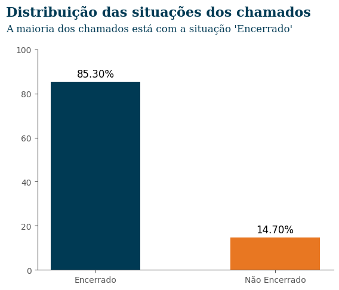


```python
plot_distribution(
    df=df,
    column="dentro_prazo",
    title="Distribuição de chamados dentro e fora do prazo",
    subtitle="A maioria dos chamados foi finalizada dentro do prazo estipulado",
    color=["#003A54", "#E87722"],
)
```


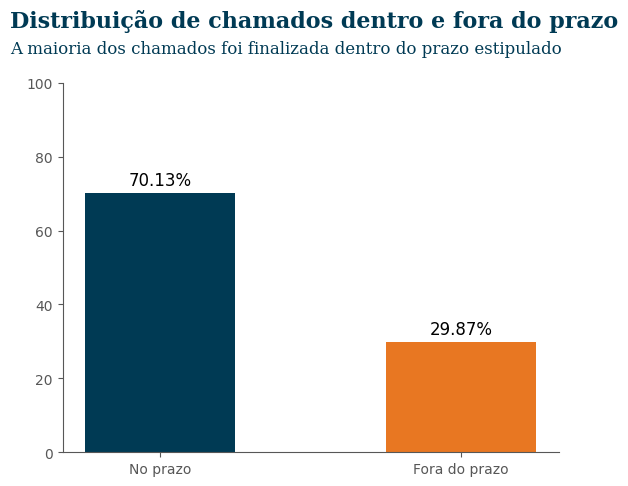


```python
# prazo_unidade dias horas
plot_distribution(
    df=df.replace({"prazo_unidade": {"D": "Dias", "H": "Horas"}}),
    column="prazo_unidade",
    title="Distribuição do prazo em dias e horas",
    subtitle="A maioria dos chamados possui prazo definido em dias",
    color=["#003A54", "#E87722"],
)
```


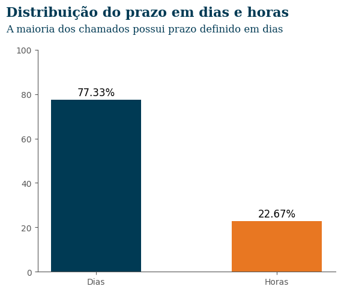


```python
plot_distribution(
    df=df.replace({"prazo_tipo": {"F": "Finalização", "D": "Diagnóstico"}}),
    column="prazo_tipo",
    title="Distribuição do prazo de finalização e diagnóstico",
    subtitle="A maioria dos chamados possui prazo de finalização",
    color=["#003A54", "#E87722"],
)
```


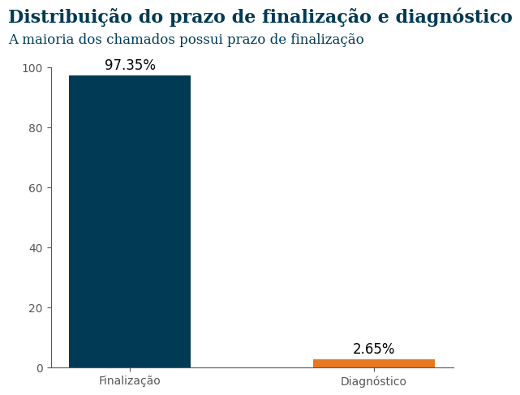


```python
plot_distribution(
    df=df,
    column="status",
    title="Distribuição dos status dos chamados",
    subtitle="A maioria dos chamados está com o status 'Fechado com solução'",
    figsize=(16, 4),
)
```


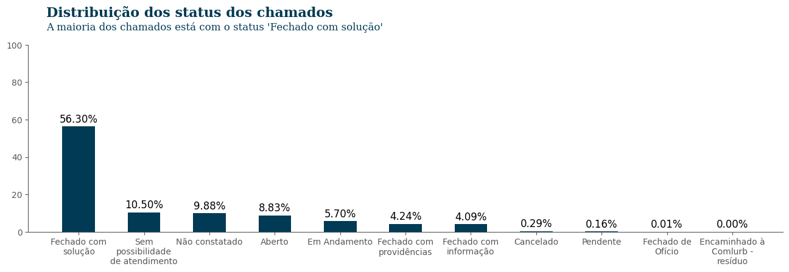


<p style="max-width:1200px; color:#003A54;text-align: justify;  font-size: 20px;">Assim, vemos que 70,13% dos chamados são encerrados no prazo, em sua maioria com prazo definido em dias e sendo do tipo finalização. No entanto, o status "Fechado com solução" representa apenas 56,30% dos chamados abertos entre 2022 e 2023.</p>


```python
plot_distribution(
    df=df.loc[df["situacao"] == "Encerrado"],
    column="status",
    title="Distribuição dos status dos chamados encerrados",
    subtitle="A maioria dos chamados encerrados está com o status 'Fechado com solução'",
    figsize=(12, 4),
)
```


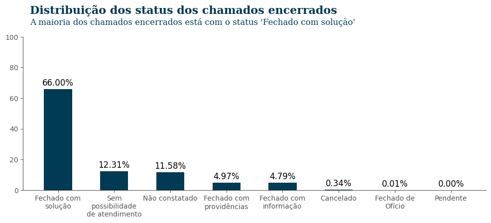


<p style="max-width:1200px; color:#003A54;text-align: justify;  font-size: 20px;">Por fim, quando observamos os chamados encerrado, vemos que o índice de "Fechado com solução" aumenta quase 10%. Para a modelagem vamos usar apenas os chamados encerrados para prever a categoria do chamado.</p>

###

<h3 style="color:#003A54; font-size: 25px; font-weight: bold;">3.2 Variáveis numéricas</h3>
<p style="max-width:1200px; color:#003A54;text-align: justify;  font-size: 20px;">As únicas variáveis numéricas que temos nessa seção são latitude, longitude e reclamações. Sendo que a para a maioria dos chamados consta o valor 0.</p>


```python
plot_distribution(
    df=df["reclamacoes"]
    .apply(lambda x: 1 if x > 0 else 0)
    .replace({0: "Sem reclamações", 1: "Com reclamações"})
    .to_frame(),
    column="reclamacoes",
    title="Distribuição das reclamações",
    subtitle="Mais de 96% dos chamados não possuem reclamações cadastradas",
    figsize=(4, 4),
)
```


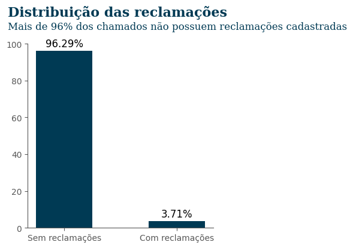


<p style="max-width:1200px; color:#003A54;text-align: justify;  font-size: 20px;">A variável "reclamações" representa a quantidade de reclamações feitas para cada chamado. A maioria dos chamados não recebeu reclamação (0 reclamações), enquanto a segunda maior parte recebeu uma reclamação apenas.</p>


```python
plot_histogram(
    df.loc[(df["reclamacoes"] > 0)],
    "reclamacoes",
    "Distribuição da quantidade de reclamações",
    figsize=(6, 3),
    width=1,
)
```


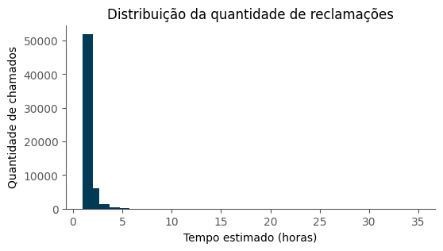


<p style="max-width:1200px; color:#003A54;text-align: justify;  font-size: 20px;">Como há muitos valores zerados, não vamos considerar essa variável para a análise.</p>


```python
df.drop(columns=["reclamacoes"], inplace=True)
```

###

<h3 style="color:#003A54; font-size: 25px; font-weight: bold;">3.3 Variáveis temporais</h3>
<p style="max-width:1200px; color:#003A54;text-align: justify;  font-size: 20px;">Nós possuímos quatro variáveis temporais, sendo elas:</p>
<ul style="max-width:1200px; color:#003A54;text-align: justify;  font-size: 20px;">
    <li><b>data_inicio</b>: Data de abertura do chamado. Ocorre quando o operador registra o chamado.</li>
    <li><b>data_fim</b>: Data de fechamento do chamado. O chamado é fechado quando o pedido é atendido ou quando se percebe que o pedido não pode ser atendido.</li>
    <li><b>data_alvo_finalizacao</b>: Data prevista para o atendimento do chamado. Caso prazo_tipo seja do tipo <var>diagnóstico</var> fica em branco até o diagnóstico ser feito.</li>
    <li><b>data_alvo_diagnostico</b>: Data prevista para fazer o diagnóstico do serviço.  Caso prazo_tipo seja <var>finalização</var> esta data fica em branco.</li>
</ul>


```python
display(
    HTML(
        f"""
        <h4 style='color:#003A54; font-size: 23px; font-weight: bold;'>Valores nulos</h4>
        <div style="max-width:1200px; color:#003A54;text-align: justify;  font-size: 20px;">
        <p>A variável <b>data_inicio</b> é a única que não possui valores nulos. Já as variáveis <b>data_fim</b>, <b>data_alvo_finalizacao</b> e <b>data_alvo_diagnostico</b> possuem 14,70%, 1,87% e 97,20% de valores nulos, respectivamente.</p>
        </div>
        """
    )
)

display(
    (df.select_dtypes(include=[np.datetime64]).isnull().sum() / df.shape[0] * 100)
    .round(2)
    .to_frame("Percentual de valores nulos (%)")
)
```


<h4 style='color:#003A54; font-size: 23px; font-weight: bold;'>Valores nulos</h4>
<div style="max-width:1200px; color:#003A54;text-align: justify;  font-size: 20px;">
<p>A variável <b>data_inicio</b> é a única que não possui valores nulos. Já as variáveis <b>data_fim</b>, <b>data_alvo_finalizacao</b> e <b>data_alvo_diagnostico</b> possuem 14,70%, 1,87% e 97,20% de valores nulos, respectivamente.</p>
</div>


<div>
<table border="1" class="dataframe">
  <thead>
    <tr style="text-align: right;">
      <th></th>
      <th>Percentual de valores nulos (%)</th>
    </tr>
  </thead>
  <tbody>
    <tr>
      <th>data_inicio</th>
      <td>0.00</td>
    </tr>
    <tr>
      <th>data_fim</th>
      <td>14.70</td>
    </tr>
    <tr>
      <th>data_alvo_finalizacao</th>
      <td>1.87</td>
    </tr>
    <tr>
      <th>data_alvo_diagnostico</th>
      <td>97.20</td>
    </tr>
  </tbody>
</table>
</div>


<p style="max-width:1200px; color:#003A54;text-align: justify;  font-size: 20px;">Criamos a variável <b>tempo_decorrido</b> que representa o tempo decorrido entre a abertura e o fechamento do chamado. A média de tempo decorrido é de 5 dias, com um desvio padrão de 7 dias. A mediana é de 3 dias, o que indica vários chamados são fechados em até 3 dias.</p>


```python
df["tempo_decorrido"] = (
    df["data_fim"] - df["data_inicio"]
).dt.total_seconds() / 3600  # em horas


display(
    HTML(
        f"""
        <h4 style='color:#003A54; font-size: 23px; font-weight: bold;'>Tempo decorrido</h4>
        <div style="max-width:1200px; color:#003A54;text-align: justify;  font-size: 20px;">
        <p>Calculamos o tempo decorrido entre a data de início e a data de fim do chamado. A média do tempo decorrido foi aproximadamente 190 dias (6 meses)
        com 75% dos chamados finalizados em até 156 dias (5 meses)</p>
        </div>
        """
    )
)

display(
    df["tempo_decorrido"]
    .describe()
    .apply(lambda x: round(x, 2))
    .to_frame("Tempo em dias")
    .T
)

plot_histogram(
    df,
    "tempo_decorrido",
    "Distribuição do tempo decorrido",
    figsize=(12, 3),
    width=100,
)
```


<h4 style='color:#003A54; font-size: 23px; font-weight: bold;'>Tempo decorrido</h4>
<div style="max-width:1200px; color:#003A54;text-align: justify;  font-size: 20px;">
<p>Calculamos o tempo decorrido entre a data de início e a data de fim do chamado. A média do tempo decorrido foi aproximadamente 190 dias (6 meses)
com 75% dos chamados finalizados em até 156 dias (5 meses)</p>
</div>


<div>
<table border="1" class="dataframe">
  <thead>
    <tr style="text-align: right;">
      <th></th>
      <th>count</th>
      <th>mean</th>
      <th>std</th>
      <th>min</th>
      <th>25%</th>
      <th>50%</th>
      <th>75%</th>
      <th>max</th>
    </tr>
  </thead>
  <tbody>
    <tr>
      <th>Tempo em dias</th>
      <td>1379847.0</td>
      <td>189.8</td>
      <td>555.03</td>
      <td>0.0</td>
      <td>3.7</td>
      <td>43.16</td>
      <td>155.19</td>
      <td>8906.15</td>
    </tr>
  </tbody>
</table>
</div>


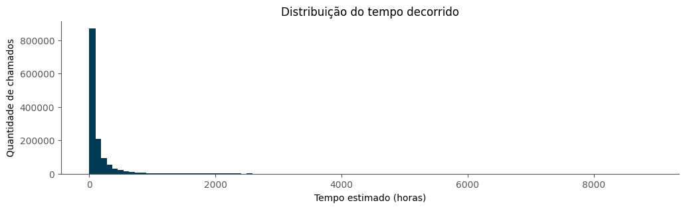


<p style="max-width:1200px; color:#003A54;text-align: justify;  font-size: 20px;">
A variável <b>urgente</b> foi criada para representar se o chamado tinha uma estimativa de tempo de até 24 horas para ser fechado. Para isso, usamos a diferença entre a data de início e a data alvo de finalização. Se a diferença for menor ou igual a 1, o chamado é considerado urgente.
</p>


```python
df["urgente"] = (
    df["data_alvo_finalizacao"] - df["data_inicio"]
).dt.total_seconds() / 3600 <= 24  # em horas

plot_distribution(
    df=df.replace({"urgente": {True: "Em até 24h", False: "Mais de 24h"}}),
    column="urgente",
    title="Estimativa de finalização de chamados em até 1 dia",
    subtitle="A maioria dos chamados não possui estimativa de finalização em até 1 dia",
    figsize=(4, 4),
)
```


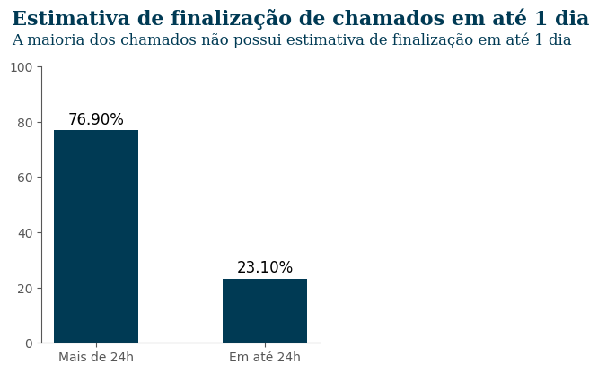


<p style="max-width:1200px; color:#003A54;text-align: justify;  font-size: 20px;">
Outra variável criada foi <b>tempo_estimado_finalizar</b> que considera o tempo estimado para finalizar o chamado. Para isso, usamos a diferença entre a data de início e a data alvo de finalização.
</p>


```python
df["tempo_estimado_finalizar"] = (
    df["data_alvo_finalizacao"] - df["data_inicio"]
).dt.total_seconds() / 3600  # em horas

display(
    HTML(
        f"""
        <h4 style='color:#003A54; font-size: 22px; font-weight: bold;'>Distribuição do tempo estimado para finalização</h4>
        <div style="max-width:1200px; color:#003A54;text-align: justify;  font-size: 20px;">
        <p>A média do tempo estimado para finalização é de aproximadamente 13 dias, sendo que até 75% dos chamados possuem estimativa de finalização em até 16 dias.</p>
        </div>
        """
    )
)

display(
    df["tempo_estimado_finalizar"]
    .describe()
    .apply(lambda x: round(x / 24, 1))
    .to_frame("tempo em dias")
    .T,
)

plot_histogram(
    df,
    "tempo_estimado_finalizar",
    "Distribuição do tempo estimado para finalização",
    figsize=(12, 3),
    width=100,
)
```


<h4 style='color:#003A54; font-size: 22px; font-weight: bold;'>Distribuição do tempo estimado para finalização</h4>
<div style="max-width:1200px; color:#003A54;text-align: justify;  font-size: 20px;">
<p>A média do tempo estimado para finalização é de aproximadamente 13 dias, sendo que até 75% dos chamados possuem estimativa de finalização em até 16 dias.</p>
</div>


<div>
<table border="1" class="dataframe">
  <thead>
    <tr style="text-align: right;">
      <th></th>
      <th>count</th>
      <th>mean</th>
      <th>std</th>
      <th>min</th>
      <th>25%</th>
      <th>50%</th>
      <th>75%</th>
      <th>max</th>
    </tr>
  </thead>
  <tbody>
    <tr>
      <th>tempo em dias</th>
      <td>66136.3</td>
      <td>12.9</td>
      <td>26.8</td>
      <td>-0.8</td>
      <td>2.0</td>
      <td>8.0</td>
      <td>15.5</td>
      <td>483.1</td>
    </tr>
  </tbody>
</table>
</div>


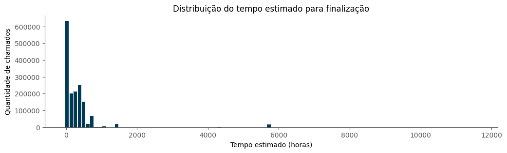


<p style="max-width:1200px; color:#003A54;text-align: justify;  font-size: 20px;">
O mesmo foi feito para a variável <b>tempo_estimado_diagnostico</b> que considera o tempo estimado para diagnosticar o chamado. Para isso, usamos a diferença entre a data de início e a data alvo de diagnóstico.
</p>


```python
df["tempo_estimado_diagnosticar"] = (
    df["data_alvo_diagnostico"] - df["data_inicio"]
).dt.total_seconds() / 3600  # em horas

plot_histogram(
    df,
    "tempo_estimado_diagnosticar",
    "Distribuição do tempo estimado para diagnóstico",
    figsize=(12, 3),
    width=10,
)
```


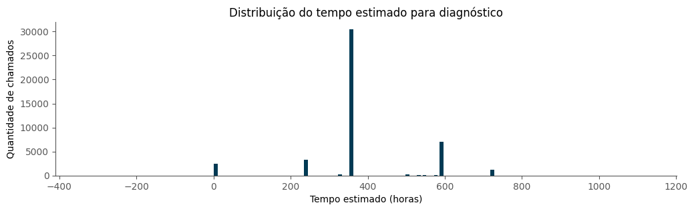


<p style="max-width:1200px; color:#003A54;text-align: justify;  font-size: 20px;">
Por fim, criamos variáveis que capturam aspectos temporais, sendo elas: <b>dia_semana</b>, <b>mes</b>, <b>dia_mes</b>, <b>estacao_ano</b> e <b>ano</b>.
</p>


```python
df["dia_semana"] = pd.Categorical(
    df["data_inicio"]
    .dt.day_name()
    .replace(
        {
            "Monday": "Segunda",
            "Tuesday": "Terça",
            "Wednesday": "Quarta",
            "Thursday": "Quinta",
            "Friday": "Sexta",
            "Saturday": "Sábado",
            "Sunday": "Domingo",
        }
    ),
    categories=[
        "Segunda",
        "Terça",
        "Quarta",
        "Quinta",
        "Sexta",
        "Sábado",
        "Domingo",
    ],
    ordered=True,
)
df["mes"] = pd.Categorical(
    df["data_inicio"]
    .dt.month_name()
    .replace(
        {
            "January": "Janeiro",
            "February": "Fevereiro",
            "March": "Março",
            "April": "Abril",
            "May": "Maio",
            "June": "Junho",
            "July": "Julho",
            "August": "Agosto",
            "September": "Setembro",
            "October": "Outubro",
            "November": "Novembro",
            "December": "Dezembro",
        }
    ),
    categories=[
        "Janeiro",
        "Fevereiro",
        "Março",
        "Abril",
        "Maio",
        "Junho",
        "Julho",
        "Agosto",
        "Setembro",
        "Outubro",
        "Novembro",
        "Dezembro",
    ],
    ordered=True,
)
df["dia_mes"] = df["data_inicio"].dt.day

# Primavera:20 de março a 21 de junho
# Verão:21 de junho a 23 de setembro
# Outono:23 de setembro a 21 de dezembro
# Inverno:21 de dezembro a 20 de março
# Os anos de 2022 e 2023 não são bissextos, então fevereiro tem 28 dias

# inverno primeira parte
df.loc[df["data_inicio"].dt.dayofyear.between(0, 79), "estacao"] = "Inverno"
# demais estações
df.loc[df["data_inicio"].dt.dayofyear.between(79, 172), "estacao"] = "Primavera"
df.loc[df["data_inicio"].dt.dayofyear.between(172, 266), "estacao"] = "Verão"
df.loc[df["data_inicio"].dt.dayofyear.between(266, 355), "estacao"] = "Outono"
# inverno segunda parte
df.loc[df["data_inicio"].dt.dayofyear.between(355, 366), "estacao"] = "Inverno"

df["estacao"] = pd.Categorical(
    df["estacao"],
    categories=["Primavera", "Verão", "Outono", "Inverno"],
    ordered=True,
)

plot_distribution(
    df=df,
    column="dia_semana",
    title="Distribuição dos chamados por dia da semana",
    subtitle="A maioria dos chamados ocorreu na terça-feira",
    figsize=(8, 4),
    sort_index=True,
)


plot_distribution(
    df=df,
    column="mes",
    title="Distribuição dos chamados por mês",
    subtitle="A maioria dos chamados ocorreu em janeiro",
    figsize=(12, 4),
    sort_index=True,
)


plot_distribution(
    df=df,
    column="estacao",
    title="Distribuição dos chamados por estação do ano",
    subtitle="A maioria dos chamados ocorreu no inverno",
    figsize=(8, 4),
)
```


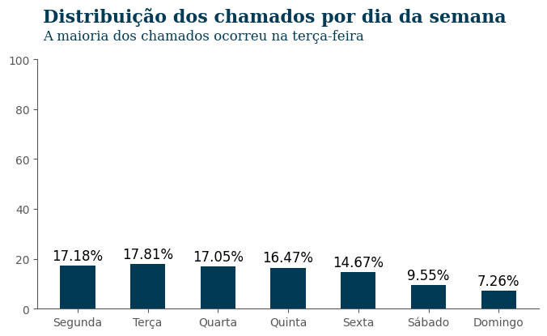


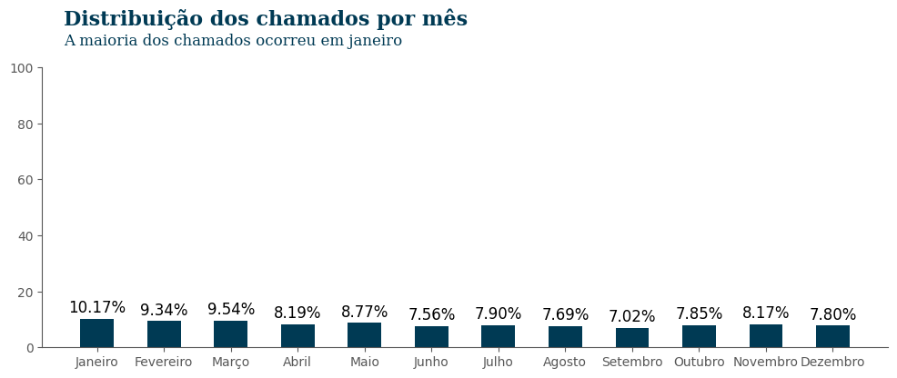


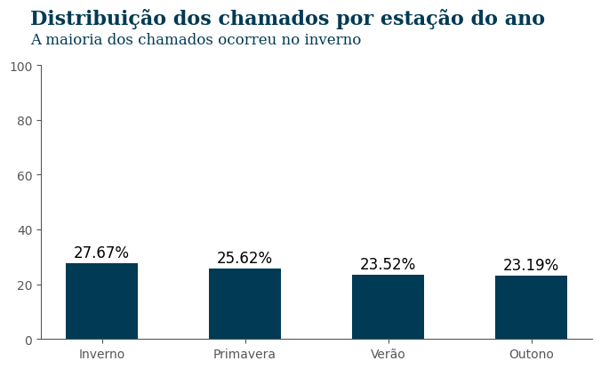


##

<div align="center">
<h2 style="color:#003A54; font-size: 30px; font-weight: bold;">4. Modelo de Classificação</h2>
</div>

<div style="max-width:1200px; width:80%; margin:0 auto;color:#003A54;text-align: justify;  font-size: 20px;">
<p>Nesta seção, desenvolvemos dois modelos de classificação, o primeiro para prever se um chamado foi encerrado com solução ou não, e o segundo para prever se foi encerrado no prazo ou não. Para isso consideramos apenas os chamados com situação do tipo "Encerrado".</p>
</div>


```python
def prepare_data(
    dataset, target_col, numeric_cols, test_size=0.3, random_state=0, proportion=1.0
):
    X_train, X_test, y_train, y_test = train_test_split(
        dataset.drop(columns=targets),
        dataset[target_col],
        test_size=test_size,
        random_state=random_state,
        stratify=dataset[target_col],
    )

    positives = (
        y_train[y_train == y_train.unique()[0]]
        .sample(
            int(y_train[y_train == y_train.unique()[1]].shape[0] * proportion),
            random_state=random_state,
        )
        .index
    )

    negatives = y_train[y_train == y_train.unique()[1]].index

    X_train = pd.concat([X_train.loc[positives], X_train.loc[negatives]]).sample(
        frac=1, random_state=random_state
    )
    y_train = y_train.loc[X_train.index]

    numeric_cols = X_train.select_dtypes(include=["number"]).columns.tolist()

    X_train[numeric_cols] = preprocessor.fit_transform(X_train[numeric_cols])
    X_test[numeric_cols] = preprocessor.transform(X_test[numeric_cols])

    return X_train, X_test, y_train, y_test


def plot_pca_cumulative_variance(data, title, ax):
    encoded_text = encode_text(data, model)
    pca = PCA(n_components=100, random_state=0)
    pca.fit(encoded_text)
    ax.plot(np.cumsum(pca.explained_variance_ratio_))
    ax.set_title(title)
    ax.set_ylim(0, 1)
    ax.set_xlim(0, 100)
    ax.set_yticks(np.arange(0, 1.1, 0.1))


def encode_text(texts: pd.Series, model: SentenceTransformer) -> np.ndarray:
    unique_text = texts.unique()
    encoded = model.encode(unique_text)
    return encoded


def pca_encode_text(texts, n_components=50):
    return PCA(n_components=n_components).fit_transform(texts)


targets = ["dentro_prazo", "status"]

model = SentenceTransformer("distiluse-base-multilingual-cased-v2")

scaler = StandardScaler()
imputer = SimpleImputer(strategy="median")

preprocessor = Pipeline(
    steps=[
        ("imputer", imputer),
        ("scaler", scaler),
    ]
).set_output(transform="pandas")
```

<div style="max-width:1200px; width:80%; margin:0 auto;color:#003A54;text-align: justify;  font-size: 20px;">
<p>Nós desconsideramos algumas colunas para essa tarefa de predição:</p>
<ul>
    <li><code>data_inicio</code>: Na seção anterior, derivamos algumas variáveis temporais que serão usadas na predição como estação do ano, dia da semana, etc.</li>
    <li><code>data_fim</code>, <code>data_alvo_finalizacao</code> e <code>data_alvo_diagnostico</code>: São variáveis que nos informam sobre o encerramento do chamado, desse modo para o modelo de previsão de chamados encerrado no prazo ou fora do prazo, essas variáveis dariam dicas sobre isso.</li>
    <li><code>tempo_decorrido</code>: É uma variável que corresponde a diferença entre a data de abertura e data de encerramento.</li>
    <li><code>situacao</code>: É a variável que usamos para filtrar os chamados considerados "Encerrados".</li>
</ul>
</div>


```python
dataset = df.loc[df["situacao"] == "Encerrado"].drop(
    columns=[
        "data_inicio",
        "data_fim",
        "data_alvo_diagnostico",
        "data_alvo_finalizacao",
        "tempo_decorrido",
        "unidade_organizacional_ouvidoria",
        "situacao",
    ],
    errors="ignore",
)
dataset.shape
```


    (1379847, 17)


```python
dataset["prazo_unidade"] = dataset["prazo_unidade"].replace({"D": "dias", "H": "horas"})
dataset["prazo_unidade"] = pd.Categorical(
    dataset["prazo_unidade"], categories=["dias", "horas"], ordered=True
)

dataset["prazo_tipo"] = dataset["prazo_tipo"].replace(
    {"D": "Diagnóstico", "F": "Finalização"}
)
dataset["prazo_tipo"] = pd.Categorical(
    dataset["prazo_tipo"], categories=["Diagnóstico", "Finalização"], ordered=True
)

dataset["dentro_prazo"] = pd.Categorical(
    dataset["dentro_prazo"], categories=["Fora do prazo", "No prazo"], ordered=True
)

dataset["status"] = dataset["status"].apply(
    lambda x: "Fechado com solução" if x == "Fechado com solução" else "Outros"
)

dataset["status"] = pd.Categorical(
    dataset["status"], categories=["Outros", "Fechado com solução"], ordered=True
)
```

<div style="max-width:1200px; width:80%; margin:0 auto;color:#003A54;text-align: justify;  font-size: 20px;">
<p>Nesse dataset, vamos usar três variáveis com campos textuais, sendo elas tipo, subtipo e nome da unidade organizacional. Para esses campos, fizemos a extração dos embeddings e aplicamos PCA para reduzir a dimensionalidade</p>
</div>


```python
fig, axs = plt.subplots(1, 3, figsize=(20, 5))

plot_pca_cumulative_variance(dataset["tipo"], "Tipo", axs[0])
plot_pca_cumulative_variance(dataset["subtipo"], "Subtipo", axs[1])
plot_pca_cumulative_variance(
    dataset["nome_unidade_organizacional"], "Unidade organizacional", axs[2]
)

plt.show()
```


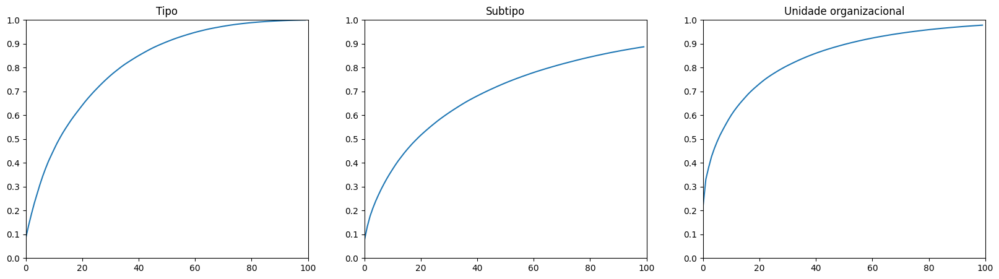


```python
text_cols = ["tipo", "subtipo", "nome_unidade_organizacional"]

encoded_cols = []

for col, n_componentes in zip(text_cols, [70, 100, 80]):
    encoded = encode_text(dataset[col], model)
    pca_encoded = pca_encode_text(encoded, n_componentes)
    mapping = dict(zip(dataset[col].unique(), pca_encoded))
    mapped = dataset[col].map(mapping)
    encoded_cols.append(
        pd.DataFrame(np.array(mapped.tolist()), index=dataset.index).add_prefix(
            f"{col}_"
        )
    )

df_encoded = pd.concat(encoded_cols, axis=1)
dataset = pd.concat([dataset, df_encoded], axis=1)
dataset.drop(columns=text_cols, inplace=True, errors="ignore")
```

<div style="max-width:1200px; width:80%; margin:0 auto;color:#003A54;text-align: justify;  font-size: 20px;">
<p>Para as demais colunas do tipo texto, aplicamos o OneHotEncoder para transformar as variáveis categóricas em numéricas.</p>
</div>


```python
categorical_cols = (
    dataset.select_dtypes(include=["category"])
    .drop(columns=targets, errors="ignore")
    .columns
)

one_hot_encoder = OneHotEncoder(sparse_output=False).set_output(transform="pandas")
encoded = one_hot_encoder.fit_transform(dataset[categorical_cols])
dataset["id_bairro"] = dataset["id_bairro"].fillna("-1").astype("category")
dataset = pd.concat([dataset, encoded], axis=1).drop(columns=categorical_cols)
```


```python
numeric_cols = dataset.select_dtypes(include=["number"]).columns.tolist()
```

### Previsão de chamados no prazo


```python
X_train, X_test, y_train, y_test = prepare_data(
    dataset, "dentro_prazo", numeric_cols, proportion=1
)
```


```python
clf = RandomForestClassifier(random_state=0, n_jobs=6)
clf.fit(X_train[:100_000], y_train[:100_000])
```

```python
y_pred = clf.predict(X_test)
print(classification_report(y_test, y_pred))
```

                   precision    recall  f1-score   support

    Fora do prazo       0.45      0.81      0.58     73618
         No prazo       0.95      0.79      0.86    340337

         accuracy                           0.79    413955
        macro avg       0.70      0.80      0.72    413955
     weighted avg       0.86      0.79      0.81    413955


```python
cm = confusion_matrix(y_test, y_pred, normalize="true")
ax = ConfusionMatrixDisplay(cm, display_labels=clf.classes_).plot(
    colorbar=False, cmap="Blues", values_format=".2f"
)

plt.title("")
plt.xlabel("")
plt.ylabel("")

plt.xticks(fontsize=12)
plt.yticks(fontsize=12)

plt.text(
    -1.8,
    1.0,
    "Valores reais",
    fontsize=14,
    fontweight="bold",
    fontfamily="serif",
    color="#003A54",
    rotation=90,
)

plt.text(
    0.0,
    2.0,
    "Valores previstos",
    fontsize=14,
    fontweight="bold",
    fontfamily="serif",
    color="#003A54",
)

plt.text(
    -1.5,
    -1.0,
    "Matriz de confusão normalizada",
    fontsize=14,
    weight="bold",
    fontfamily="serif",
    color="#003A54",
)

plt.text(
    -1.6,
    -0.6,
    """
    81% dos chamados, que foram encerrados fora do prazo,\n
    foram classificados corretamente\n
    """,
    fontsize=12,
    fontfamily="serif",
    color="#003A54",
    linespacing=0.5,
)

plt.show()
```


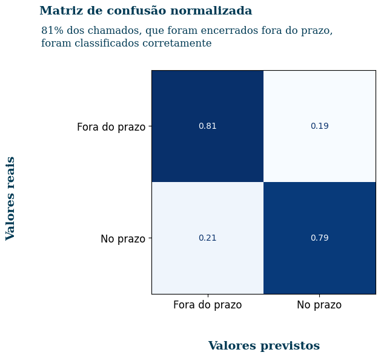


### Previsão do status do chamado


```python
X_train, X_test, y_train, y_test = prepare_data(dataset, "status", numeric_cols)
```


```python
clf = RandomForestClassifier(random_state=0, n_jobs=6)
clf.fit(X_train[:100_000], y_train[:100_000])
```


```python
y_pred = clf.predict(X_test)
print(classification_report(y_test, y_pred))
```

                         precision    recall  f1-score   support

    Fechado com solução       0.87      0.79      0.83    273192
                 Outros       0.66      0.76      0.70    140763

               accuracy                           0.78    413955
              macro avg       0.76      0.78      0.77    413955
           weighted avg       0.79      0.78      0.79    413955


```python
cm = confusion_matrix(y_test, y_pred, normalize="true")
ax = ConfusionMatrixDisplay(cm, display_labels=clf.classes_).plot(
    colorbar=False, cmap="Blues", values_format=".2f"
)

plt.title("")
plt.xlabel("")
plt.ylabel("")

plt.xticks(fontsize=12)
plt.yticks(fontsize=12)

plt.text(
    -1.8,
    1.0,
    "Valores reais",
    fontsize=14,
    fontweight="bold",
    fontfamily="serif",
    color="#003A54",
    rotation=90,
)

plt.text(
    0.0,
    2.0,
    "Valores previstos",
    fontsize=14,
    fontweight="bold",
    fontfamily="serif",
    color="#003A54",
)

plt.text(
    -1.5,
    -1.0,
    "Matriz de confusão normalizada",
    fontsize=14,
    weight="bold",
    fontfamily="serif",
    color="#003A54",
)

plt.text(
    -1.6,
    -0.6,
    """
    79% dos chamados, que foram fechados com solução, foram\n
    previstos corretamente
    """,
    fontsize=12,
    fontfamily="serif",
    color="#003A54",
    linespacing=0.5,
)

plt.show()
```


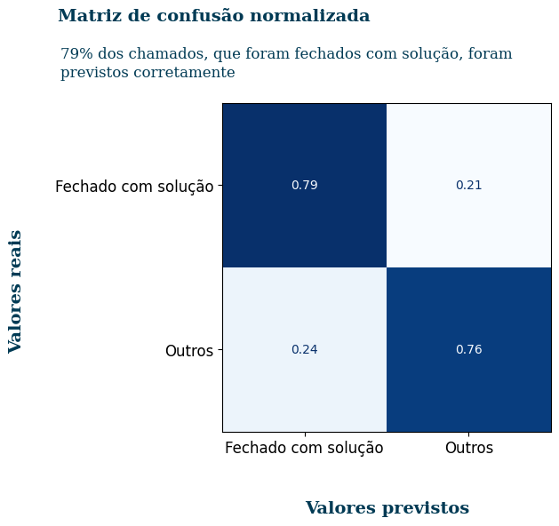
