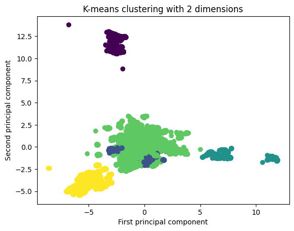
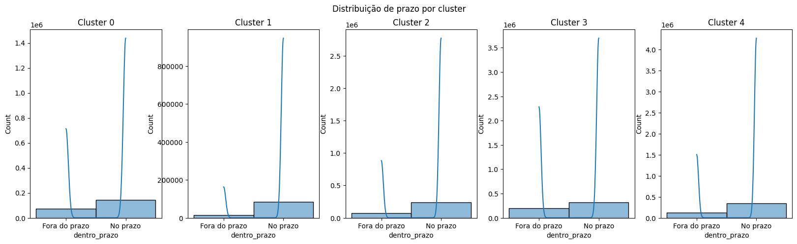
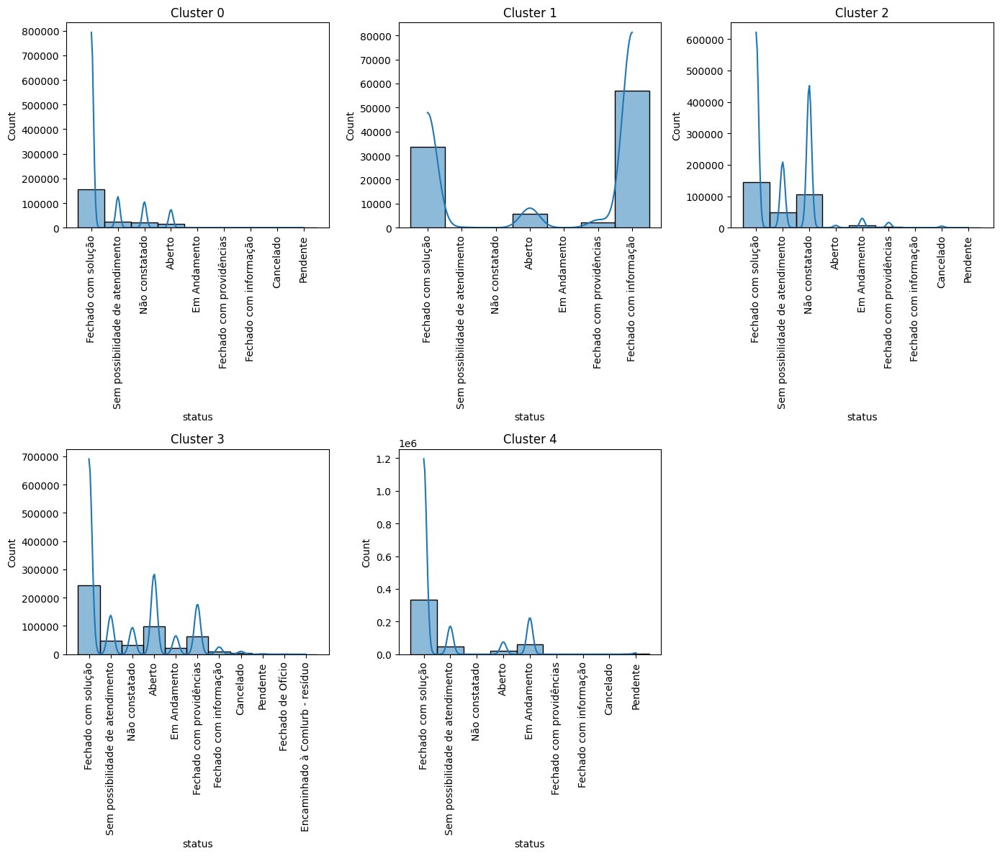
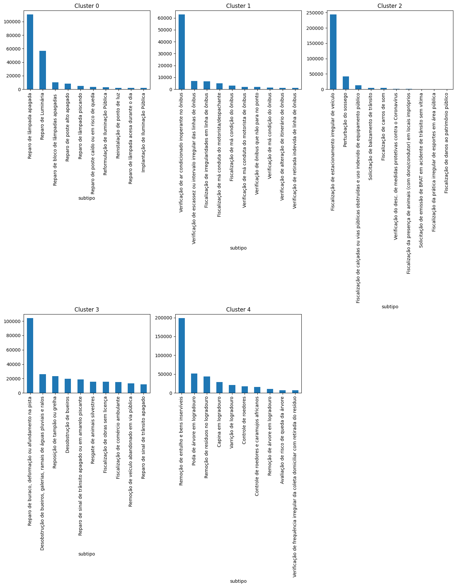
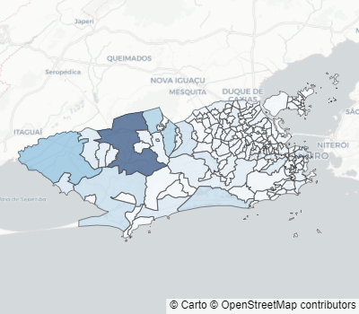
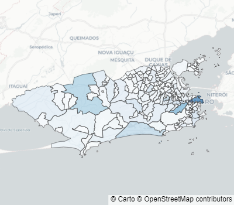
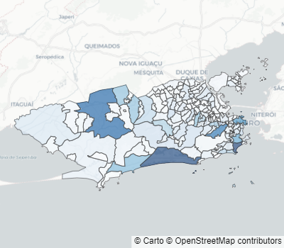
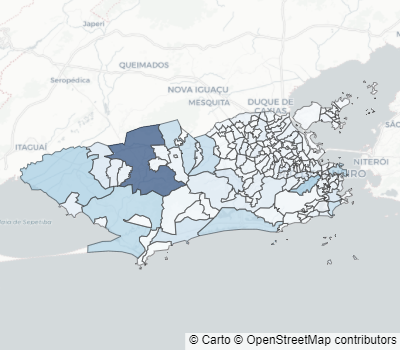
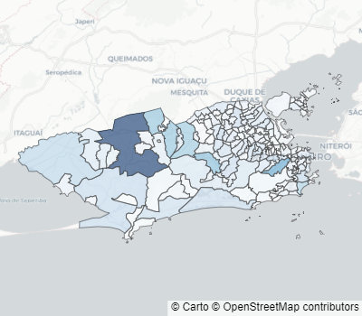

# Clusterização dos chamados a Central 1746

Nesse notebook, prentedemos identificar grupos de chamados a Central 1746 que possam ser tratados de forma semelhante. Para isso, utilizamos técnicas de clusterização, que são técnicas de aprendizado não supervisionado que buscam agrupar dados semelhantes.


```python
import pandas as pd
import pandas_gbq
import matplotlib.pyplot as plt
import seaborn as sns
import numpy as np
from sklearn.decomposition import PCA
from sklearn.preprocessing import OrdinalEncoder
from sklearn.pipeline import Pipeline
from sklearn.impute import SimpleImputer
from sklearn.preprocessing import StandardScaler
from sentence_transformers import SentenceTransformer
import matplotlib.gridspec as gridspec
import geopandas as gpd
import pandas as pd
import plotly.express as px
import plotly.graph_objects as go
from sklearn.cluster import KMeans
```

Selecionamos algumas colunas com base na análise exploratória feita no notebook de previsão de chamados.


```python
df = pd.read_parquet(
    "../data/chamado_1746.parquet",
    columns=[
        "id_chamado",
        "id_bairro",
        "data_inicio",
        "data_fim",
        "tipo",
        "subtipo",
        "status",
        "nome_unidade_organizacional",
        "unidade_organizacional_ouvidoria",
        "data_alvo_finalizacao",
        "data_alvo_diagnostico",
        "prazo_unidade",
        "prazo_tipo",
        "dentro_prazo",
        "situacao",
        "latitude",
        "longitude",
    ],
)

df = df.set_index("id_chamado")
```

## Transformação dos dados

A partir das variáveis de datas, foram extraídas as seguintes variáveis:
- tempo decorrido
- urgente
- tempo estimado finalizar
- tempo estimado diagnosticar
- dia da semana
- dia do mês
- estações do ano


```python
df["tempo_decorrido"] = (df["data_fim"] - df["data_inicio"]).dt.total_seconds() / 3600

df["urgente"] = (
    df["data_alvo_finalizacao"] - df["data_inicio"]
).dt.total_seconds() / 3600 <= 24

df["tempo_estimado_finalizar"] = (
    df["data_alvo_finalizacao"] - df["data_inicio"]
).dt.total_seconds() / 3600

df["tempo_estimado_diagnosticar"] = (
    df["data_alvo_diagnostico"] - df["data_inicio"]
).dt.total_seconds() / 3600


df.drop(
    columns=["data_alvo_finalizacao", "data_alvo_diagnostico", "data_fim"],
    inplace=True,
)
```


```python
df["dia_semana"] = pd.Categorical(
    df["data_inicio"]
    .dt.day_name()
    .replace(
        {
            "Monday": "Segunda",
            "Tuesday": "Terça",
            "Wednesday": "Quarta",
            "Thursday": "Quinta",
            "Friday": "Sexta",
            "Saturday": "Sábado",
            "Sunday": "Domingo",
        }
    ),
    categories=[
        "Segunda",
        "Terça",
        "Quarta",
        "Quinta",
        "Sexta",
        "Sábado",
        "Domingo",
    ],
    ordered=True,
)
df["mes"] = pd.Categorical(
    df["data_inicio"]
    .dt.month_name()
    .replace(
        {
            "January": "Janeiro",
            "February": "Fevereiro",
            "March": "Março",
            "April": "Abril",
            "May": "Maio",
            "June": "Junho",
            "July": "Julho",
            "August": "Agosto",
            "September": "Setembro",
            "October": "Outubro",
            "November": "Novembro",
            "December": "Dezembro",
        }
    ),
    categories=[
        "Janeiro",
        "Fevereiro",
        "Março",
        "Abril",
        "Maio",
        "Junho",
        "Julho",
        "Agosto",
        "Setembro",
        "Outubro",
        "Novembro",
        "Dezembro",
    ],
    ordered=True,
)
df["dia_mes"] = df["data_inicio"].dt.day

# Primavera:20 de março a 21 de junho
# Verão:21 de junho a 23 de setembro
# Outono:23 de setembro a 21 de dezembro
# Inverno:21 de dezembro a 20 de março
# Os anos de 2022 e 2023 não são bissextos, então fevereiro tem 28 dias

# inverno primeira parte
df.loc[df["data_inicio"].dt.dayofyear.between(0, 79), "estacao"] = "Inverno"
# demais estações
df.loc[df["data_inicio"].dt.dayofyear.between(79, 172), "estacao"] = "Primavera"
df.loc[df["data_inicio"].dt.dayofyear.between(172, 266), "estacao"] = "Verão"
df.loc[df["data_inicio"].dt.dayofyear.between(266, 355), "estacao"] = "Outono"
# inverno segunda parte
df.loc[df["data_inicio"].dt.dayofyear.between(355, 366), "estacao"] = "Inverno"

df["estacao"] = pd.Categorical(
    df["estacao"],
    categories=["Primavera", "Verão", "Outono", "Inverno"],
    ordered=True,
)

df.drop(columns=["data_inicio"], inplace=True)
```

Também realizamos a padronização de algumas variáveis, transformando algumas colunas no tipo categórico. Sendo elas:

- prazo_unidade
- prazo_tipo
- dentro_prazo
- status
- unidade_organizacional_ouvidoria
- id_bairro
- situacao


```python
df["prazo_unidade"] = df["prazo_unidade"].replace({"D": "dias", "H": "horas"})
df["prazo_unidade"] = pd.Categorical(
    df["prazo_unidade"], categories=["dias", "horas"], ordered=True
)

df["prazo_tipo"] = df["prazo_tipo"].replace({"D": "Diagnóstico", "F": "Finalização"})
df["prazo_tipo"] = pd.Categorical(
    df["prazo_tipo"], categories=["Diagnóstico", "Finalização"], ordered=True
)

df["dentro_prazo"] = pd.Categorical(
    df["dentro_prazo"], categories=["Fora do prazo", "No prazo"], ordered=True
)

df["status"] = pd.Categorical(
    df["status"], categories=df["status"].value_counts().index
)

df["unidade_organizacional_ouvidoria"] = pd.Categorical(
    df["unidade_organizacional_ouvidoria"],
    categories=df["unidade_organizacional_ouvidoria"].value_counts().index,
)

df["id_bairro"] = pd.Categorical(
    df["id_bairro"], categories=df["id_bairro"].value_counts().index
)
df["situacao"] = pd.Categorical(
    df["situacao"], categories=["Não Encerrado", "Encerrado"], ordered=True
)
```

## Pré-processamento dos dados

As colunas tipo, subtipo e nome da unidade organizacional tiveram seus embeddings extraídos a partir de um modelo pré-treinado. Em seguida, todas as variáveis foram padronizadas.


```python
model = SentenceTransformer("distiluse-base-multilingual-cased-v2")

scaler = StandardScaler()
imputer = SimpleImputer(strategy="median")


def encode_text(texts: pd.Series, model: SentenceTransformer) -> np.ndarray:
    unique_text = texts.unique()
    encoded = model.encode(unique_text)
    return encoded


def pca_encode_text(texts, n_components=50):
    return PCA(n_components=n_components).fit_transform(texts)


preprocessor = Pipeline(
    steps=[
        ("imputer", imputer),
        ("scaler", scaler),
    ]
).set_output(transform="pandas")
```


```python
text_cols = ["tipo", "subtipo", "nome_unidade_organizacional"]
text_dimensions = [25, 50, 100]
encoded_cols = []

for col, n_componentes in zip(text_cols, text_dimensions):
    encoded = encode_text(df[col], model)
    pca_encoded = pca_encode_text(encoded, n_componentes)
    mapping = dict(zip(df[col].unique(), pca_encoded))
    mapped = df[col].map(mapping)
    encoded_cols.append(
        pd.DataFrame(np.array(mapped.tolist()), index=df.index).add_prefix(f"{col}_")
    )

df_encoded = pd.concat(encoded_cols, axis=1)
dataset = pd.concat([df, df_encoded], axis=1)
dataset.drop(columns=text_cols, inplace=True, errors="ignore")
```


```python
ordinal_encoder = OrdinalEncoder()

categorical_cols = dataset.select_dtypes(include=["category"]).columns.tolist()
dataset[categorical_cols] = ordinal_encoder.fit_transform(dataset[categorical_cols])
dataset[categorical_cols] = dataset[categorical_cols]
dataset = preprocessor.fit_transform(dataset)
```


```python
dataset.shape
```


    (1617598, 192)


## Treinamento modelo

Foi utilizado o algoritmo KMeans para realizar a clusterização dos chamados. O número de clusters foi escolhido para uma rápida análise sobre os dados.


```python
kmeans = KMeans(n_clusters=5, random_state=42)
kmeans.fit(dataset)
clusters = kmeans.predict(dataset)
df["cluster"] = clusters
```

### Analisar clusters

Após a clusterização, foi feita uma análise dos clusters gerados, com o objetivo de identificar padrões e comportamentos dos chamados. Para uma visualização mais clara, foi utilizado o algoritmo PCA para redução de dimensionalidade dos dados.


```python
dataset_embedded = PCA(n_components=2, random_state=0).fit_transform(dataset)

plt.scatter(dataset_embedded[:, 0], dataset_embedded[:, 1], c=kmeans.labels_)
plt.xlabel("First principal component")
plt.ylabel("Second principal component")
plt.title("K-means clustering with 2 dimensions")
plt.show()
```





Vemos que os clusters 1 e 2 possuem menor tempo na média para finalizar o atendimento, enquanto o cluster 3 possui a maior média.


```python
cluster_stats = (
    df.reset_index()
    .groupby("cluster")
    .agg(
        {
            "tempo_decorrido": ["min", "max", "mean"],
            "tempo_estimado_finalizar": ["min", "max", "mean"],
            "tempo_estimado_diagnosticar": ["min", "max", "mean"],
            "id_chamado": "count",
        }
    )
)

cluster_stats
```


<div>
<style scoped>
    .dataframe tbody tr th:only-of-type {
        vertical-align: middle;
    }

    .dataframe tbody tr th {
        vertical-align: top;
    }

    .dataframe thead tr th {
        text-align: left;
    }

    .dataframe thead tr:last-of-type th {
        text-align: right;
    }
</style>
<table border="1" class="dataframe">
  <thead>
    <tr>
      <th></th>
      <th colspan="3" halign="left">tempo_decorrido</th>
      <th colspan="3" halign="left">tempo_estimado_finalizar</th>
      <th colspan="3" halign="left">tempo_estimado_diagnosticar</th>
      <th>id_chamado</th>
    </tr>
    <tr>
      <th></th>
      <th>min</th>
      <th>max</th>
      <th>mean</th>
      <th>min</th>
      <th>max</th>
      <th>mean</th>
      <th>min</th>
      <th>max</th>
      <th>mean</th>
      <th>count</th>
    </tr>
    <tr>
      <th>cluster</th>
      <th></th>
      <th></th>
      <th></th>
      <th></th>
      <th></th>
      <th></th>
      <th></th>
      <th></th>
      <th></th>
      <th></th>
    </tr>
  </thead>
  <tbody>
    <tr>
      <th>0</th>
      <td>0.000000</td>
      <td>7119.563056</td>
      <td>113.496697</td>
      <td>5.983611</td>
      <td>3855.674444</td>
      <td>98.274461</td>
      <td>412.787500</td>
      <td>504.219167</td>
      <td>449.434907</td>
      <td>217313</td>
    </tr>
    <tr>
      <th>1</th>
      <td>0.000000</td>
      <td>4121.176944</td>
      <td>82.899739</td>
      <td>9.983889</td>
      <td>3311.494167</td>
      <td>248.457236</td>
      <td>NaN</td>
      <td>NaN</td>
      <td>NaN</td>
      <td>98670</td>
    </tr>
    <tr>
      <th>2</th>
      <td>0.000000</td>
      <td>8618.770278</td>
      <td>81.563009</td>
      <td>1.983611</td>
      <td>7754.323611</td>
      <td>30.674316</td>
      <td>182.256111</td>
      <td>182.256111</td>
      <td>182.256111</td>
      <td>312374</td>
    </tr>
    <tr>
      <th>3</th>
      <td>0.000000</td>
      <td>8856.228889</td>
      <td>303.296039</td>
      <td>-19.050000</td>
      <td>8825.470833</td>
      <td>334.161875</td>
      <td>-336.796944</td>
      <td>1128.622500</td>
      <td>137.215050</td>
      <td>523058</td>
    </tr>
    <tr>
      <th>4</th>
      <td>0.014167</td>
      <td>8906.150000</td>
      <td>223.743765</td>
      <td>0.045000</td>
      <td>11594.255556</td>
      <td>589.543204</td>
      <td>239.983611</td>
      <td>1127.906667</td>
      <td>400.768431</td>
      <td>466183</td>
    </tr>
  </tbody>
</table>
</div>


```python
fig, axes = plt.subplots(1, 5, figsize=(20, 5))
fig.suptitle("Distribuição de prazo por cluster")
for i in range(5):
    ax = axes[i]
    sns.histplot(
        df[df["cluster"] == i]["dentro_prazo"],
        kde=True,
        ax=ax,
    )
    ax.set_title(f"Cluster {i}")
```





Abaixo temos as imagens com distribuição dos status dos chamados em cada cluster


```python
fig = plt.figure(figsize=(14, 12))
specs = gridspec.GridSpec(nrows=2, ncols=3, figure=fig)


for i in range(5):
    ax = fig.add_subplot(specs[i // 3, i % 3])
    sns.histplot(
        df[df["cluster"] == i]["status"],
        kde=True,
        ax=ax,
    )
    ax.set_title(f"Cluster {i}")
    ax.tick_params(axis="x", rotation=90)
    plt.tight_layout()
plt.show()
```





Abaixo, destacamos os subtipos mais comuns em cada cluster, vemos que:

- Cluster 1: Os subtipos mais comuns são relacionados a lâmpadas
- Cluster 2: Tem mais chamados relacionados a ônibus
- Cluster 3: Esse cluster agrupou mais chamados relacionados a fiscalização
- Cluster 4: Tem chamados relacionados a obstrução via pública como bueiros, animais sivelstres.
- Cluster 5: Tem chamados relacionados a limpeza


```python
fig = plt.figure(figsize=(14, 18))
specs = gridspec.GridSpec(nrows=2, ncols=3, figure=fig)

for i in range(5):
    ax = fig.add_subplot(specs[i // 3, i % 3])
    df[clusters == i]["subtipo"].value_counts().head(10).plot(kind="bar", ax=ax)
    ax.set_title(f"Cluster {i}")
    ax.tick_params(axis="x", rotation=90)
    plt.tight_layout()

plt.show()
```





### Análise bairros

Por fim, nessa seção mostramos os plots para cada bairro de acordo com o cluster selecionado.


```python
def make_choropleth(calls: pd.DataFrame, neighborhoods: pd.DataFrame) -> go.Figure:
    """
    Cria um mapa de coroplético com base nos chamados por bairro.

    Args:
        calls (pd.DataFrame): O dataframe contendo os chamados.
        neighborhoods (pd.DataFrame): O dataframe contendo os bairros.

    Returns:
        go.Figure: O objeto figura do Plotly contendo o mapa de coroplético.
    """
    # Agrupa os chamados por bairro
    neighboards_calls = (
        calls.merge(neighborhoods, how="right", on="id_bairro")
        .groupby("id_bairro")
        .agg(
            {
                "id_bairro": "count",
                # "nome": "first",
                "geometry": "first",
            }
        )
        .rename(columns={"id_bairro": "chamados"})
        .sort_values("chamados", ascending=False)
    )

    # Cria um GeoDataFrame a partir do resultado
    neighboards_calls = gpd.GeoDataFrame(
        neighboards_calls,
        geometry=gpd.GeoSeries.from_wkt(neighboards_calls["geometry"]),
        crs="EPSG:4326",
    )

    # Cria o mapa de coroplético
    fig = px.choropleth_mapbox(
        neighboards_calls,
        geojson=neighboards_calls["geometry"],
        locations=neighboards_calls.index,
        color="chamados",
        color_continuous_scale="Blues",
        range_color=(0, neighboards_calls["chamados"].max()),
        mapbox_style="carto-positron",
        zoom=8.5,
        center={"lat": -22.914469232838503, "lon": -43.4461895474592},
        opacity=0.6,
        # hover_data={"nome": True,  "chamados": True},
        width=400,
        height=350,
    )

    # Configurações adicionais para o layout do gráfico
    fig.update_layout(
        coloraxis_showscale=False,
        margin={"r": 0, "t": 0, "l": 0, "b": 0},
    )

    return fig
```


```python
bairro = pd.read_parquet(
    "../data/bairro.parquet", columns=["id_bairro", "nome", "geometry"]
)
```


```python
raw_chamado_1746 = df.merge(bairro, how="left", on="id_bairro")
raw_chamado_1746["cluster"] = clusters
```


```python
print("Top-5 subtipos mais comuns:")
print(df[df["cluster"] == 0]["subtipo"].value_counts().head(5).index)

fig = make_choropleth(df[df["cluster"] == 0], bairro)
fig.show()
```

    Top-5 subtipos mais comuns:
    Index(['Reparo de lâmpada apagada', 'Reparo de Luminária',
           'Reparo de bloco de lâmpadas apagadas ', 'Reparo de poste alto apagado',
           'Reparo de lâmpada piscando'],
          dtype='object', name='subtipo')



```python
print("Top-5 subtipos mais comuns:")
print(df[df["cluster"] == 1]["subtipo"].value_counts().head(5).index)
fig = make_choropleth(df[df["cluster"] == 1], bairro)
fig.show()
```

    Top-5 subtipos mais comuns:
    Index(['Verificação de ar condicionado inoperante no ônibus',
           'Verificação de escassez ou intervalo irregular das linhas de ônibus',
           'Fiscalização de irregularidades em linha de ônibus',
           'Fiscalização de má conduta do motorista/despachante',
           'Fiscalização de má condição do ônibus'],
          dtype='object', name='subtipo')



```python
print("Top-5 subtipos mais comuns:")
print(df[df["cluster"] == 2]["subtipo"].value_counts().head(5).index)
fig = make_choropleth(df[df["cluster"] == 2], bairro)
fig.show()
```

    Top-5 subtipos mais comuns:
    Index(['Fiscalização de estacionamento irregular de veículo',
           'Perturbação do sossego',
           'Fiscalização de calçadas ou vias públicas obstruídas e uso indevido de equipamento público',
           'Solicitação de balizamento de trânsito',
           'Fiscalização de carros de som'],
          dtype='object', name='subtipo')



```python
print("Top-5 subtipos mais comuns:")
print(df[df["cluster"] == 3]["subtipo"].value_counts().head(5).index)
fig = make_choropleth(df[df["cluster"] == 3], bairro)
fig.show()
```

    Top-5 subtipos mais comuns:
    Index(['Reparo de buraco, deformação ou afundamento na pista',
           'Desobstrução de bueiros, galerias, ramais de águas pluviais e ralos',
           'Reposição de tampão ou grelha', 'Desobstrução de bueiros',
           'Reparo de sinal de trânsito apagado ou em amarelo piscante'],
          dtype='object', name='subtipo')



```python
print("Top-5 subtipos mais comuns:")
print(df[df["cluster"] == 4]["subtipo"].value_counts().head(5).index)
fig = make_choropleth(df[df["cluster"] == 4], bairro)
fig.show()
```

    Top-5 subtipos mais comuns:
    Index(['Remoção de entulho e bens inservíveis', 'Poda de árvore em logradouro',
           'Remoção de resíduos no logradouro', 'Capina em logradouro',
           'Varrição de logradouro'],
          dtype='object', name='subtipo')


Uma análise adicional mais detalhada é necessária para entender melhor os clusters e identificar padrões e comportamentos dos chamados. Mas, com base na análise feita, identificamos que há grupos que podem ser verificados de forma semelhante.
